# Лабораторная работа №6
## Система контроля версий
### Цель работы
Изучение базовых возможностей системы управления версиями, получение опыта работы с Git API, опыт работы с локальным и удаленным репозиторием.
### Ход работы
#### 1. Создание аккаунта на GitHub

#### 2. Fork репозитория
Выполнен fork репозитория https://github.com/Kurtyanik/LR6/ в личное хранилище.
#### 3. Настройка git
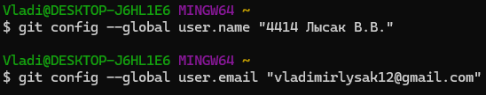
#### 4. Клонирование своего личного удалённый репозитория на компьютер
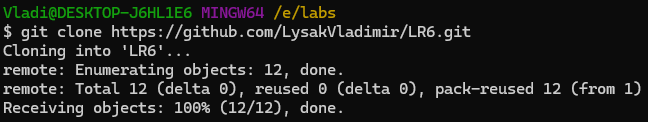
#### 5. Добавление файла через интерфейс GitHub. Подтянуть изменения в локальный репозиторий
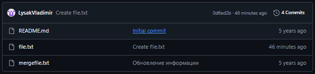

#### 6. Получена история операций
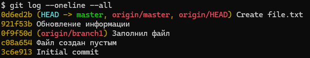
#### 7. Просмотрены последние изменения
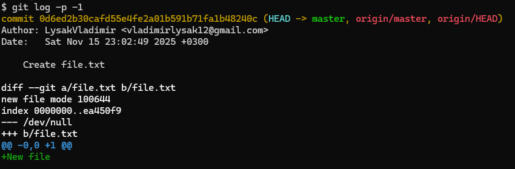
#### 8. Выполнено слияние веток
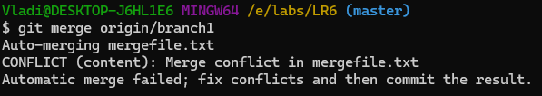

Конфликт слияния разрешен в программе Блокнот объединением в один файл

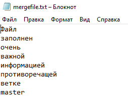
#### 9. Удалена побочная ветка
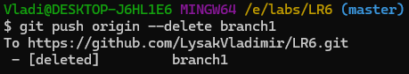
#### 10. Коммит измения(слияния)
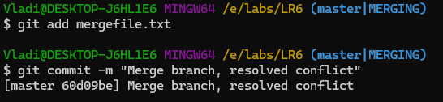
#### 11. Сделаны несколько изменений
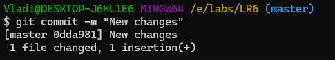

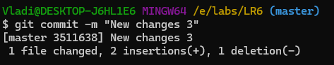
#### 12. Откат коммита
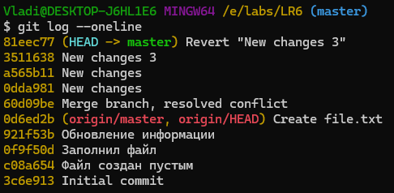
#### 13. Ветка для отчета
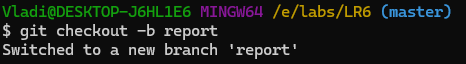
